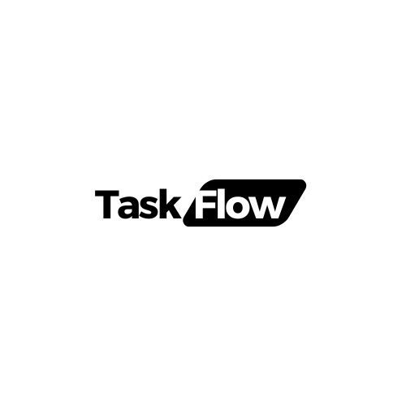

<!-- Improved compatibility of back to top link: See: https://github.com/othneildrew/Best-README-Template/pull/73 -->
<a name="readme-top"></a>
<!--
*** Thanks for checking out the Best-README-Template. If you have a suggestion
*** that would make this better, please fork the repo and create a pull request
*** or simply open an issue with the tag "enhancement".
*** Don't forget to give the project a star!
*** Thanks again! Now go create something AMAZING! :D
-->


<!-- PROJECT SHIELDS -->
<!--
*** I'm using markdown "reference style" links for readability.
*** Reference links are enclosed in brackets [ ] instead of parentheses ( ).
*** See the bottom of this document for the declaration of the reference variables
*** for contributors-url, forks-url, etc. This is an optional, concise syntax you may use.
*** https://www.markdownguide.org/basic-syntax/#reference-style-links
-->
[![Contributors][contributors-shield]][contributors-url]
[![Forks][forks-shield]][forks-url]
[![Stargazers][stars-shield]][stars-url]
[![Issues][issues-shield]][issues-url]
[![MIT License][license-shield]][license-url]
[![LinkedIn][linkedin-shield]][linkedin-url]


<!-- PROJECT LOGO -->
<br />
<div align="center">
  <a href="https://github.com/BRAINIAC2677/taskflow-express-api">
    
  </a>

<h3 align="center">TaskFlow Express API</h3>

  <p align="center">
    An advanced AI powered task management system
    <br />
    <a href="https://taskflow-2c96.onrender.com/"><strong>Explore it live »</strong></a>
    <br />
    <br />
    <a href="https://github.com/BRAINIAC2677/taskflow">Front-end</a>
    ·
    <a href="https://github.com/BRAINIAC2677/taskflow-express-api/issues/new?labels=bug&template=bug-report---.md">Report Bug</a>
    ·
    <a href="https://github.com/BRAINIAC2677/taskflow-express-api/issues/new?labels=enhancement&template=feature-request---.md">Request Feature</a>
  </p>
</div>

<!-- GETTING STARTED -->
## Getting Started

This is an example of how you may give instructions on setting up your project locally.
To get a local copy up and running follow these simple example steps.

### Prerequisites

This is an example of how to list things you need to use the software and how to install them.
* npm
  ```sh
  npm install npm@latest -g
  ```

### Installation

- Clone the repo
   ```sh
   git clone https://github.com/BRAINIAC2677/taskflow-express-api.git
   ```
- Install NPM packages
   ```sh
   npm install
   ```
- Populate the [.env](.env) file with the following values
   ```sh
    SUPABASEHOST=
    SUPABASEPORT=
    SUPABASEURL=
    SUPABASEDATABASE=
    SUPABASEUSER=
    SUPABASEPASSWORD=
    SUPABASE_ANON_KEY=
    SUPABASE_SERVICE_KEY=
    OPENAI_API_KEY=
   ```
- You have to generate these credentials from [Supabase](https://supabase.io/) and [OpenAI](https://openai.com/)
- Also you have to copy `prod-ca-*.crt` file in your root directory for ssl connection to supabase by pg-promise.

<p align="right">(<a href="#readme-top">back to top</a>)</p>


<!-- LICENSE -->
## License

Distributed under the MIT License. See `LICENSE.txt` for more information.

<p align="right">(<a href="#readme-top">back to top</a>)</p>


<!-- CONTACT -->
## Contact

Asif Azad - asifazad0178@gmail.com
<br>

Project Link: [https://github.com/BRAINIAC2677/taskflow-express-api](https://github.com/BRAINIAC2677/taskflow-express-api)


<!-- MARKDOWN LINKS & IMAGES -->
<!-- https://www.markdownguide.org/basic-syntax/#reference-style-links -->
[contributors-shield]: https://img.shields.io/github/contributors/BRAINIAC2677/taskflow-express-api.svg?style=for-the-badge
[contributors-url]: https://github.com/BRAINIAC2677/taskflow-express-api/graphs/contributors
[forks-shield]: https://img.shields.io/github/forks/BRAINIAC2677/taskflow-express-api.svg?style=for-the-badge
[forks-url]: https://github.com/BRAINIAC2677/taskflow-express-api/network/members
[stars-shield]: https://img.shields.io/github/stars/BRAINIAC2677/taskflow-express-api.svg?style=for-the-badge
[stars-url]: https://github.com/BRAINIAC2677/taskflow-express-api/stargazers
[issues-shield]: https://img.shields.io/github/issues/BRAINIAC2677/taskflow-express-api.svg?style=for-the-badge
[issues-url]: https://github.com/BRAINIAC2677/taskflow-express-api/issues
[license-shield]: https://img.shields.io/github/license/BRAINIAC2677/taskflow-express-api.svg?style=for-the-badge
[license-url]: https://github.com/BRAINIAC2677/taskflow-express-api/blob/master/LICENSE.txt
[linkedin-shield]: https://img.shields.io/badge/-LinkedIn-black.svg?style=for-the-badge&logo=linkedin&colorB=555
[linkedin-url]: https://linkedin.com/in/asifazad2677
[product-screenshot]: assets/taskview-showcase.png
[Next.js]: https://img.shields.io/badge/next.js-000000?style=for-the-badge&logo=nextdotjs&logoColor=white
[Next-url]: https://nextjs.org/
[React.js]: https://img.shields.io/badge/React-20232A?style=for-the-badge&logo=react&logoColor=61DAFB
[React-url]: https://reactjs.org/
[Vue.js]: https://img.shields.io/badge/Vue.js-35495E?style=for-the-badge&logo=vuedotjs&logoColor=4FC08D
[Vue-url]: https://vuejs.org/
[Angular.io]: https://img.shields.io/badge/Angular-DD0031?style=for-the-badge&logo=angular&logoColor=white
[Angular-url]: https://angular.io/
[Svelte.dev]: https://img.shields.io/badge/Svelte-4A4A55?style=for-the-badge&logo=svelte&logoColor=FF3E00
[Svelte-url]: https://svelte.dev/
[Laravel.com]: https://img.shields.io/badge/Laravel-FF2D20?style=for-the-badge&logo=laravel&logoColor=white
[Laravel-url]: https://laravel.com
[Bootstrap.com]: https://img.shields.io/badge/Bootstrap-563D7C?style=for-the-badge&logo=bootstrap&logoColor=white
[Bootstrap-url]: https://getbootstrap.com
[JQuery.com]: https://img.shields.io/badge/jQuery-0769AD?style=for-the-badge&logo=jquery&logoColor=white
[JQuery-url]: https://jquery.com 